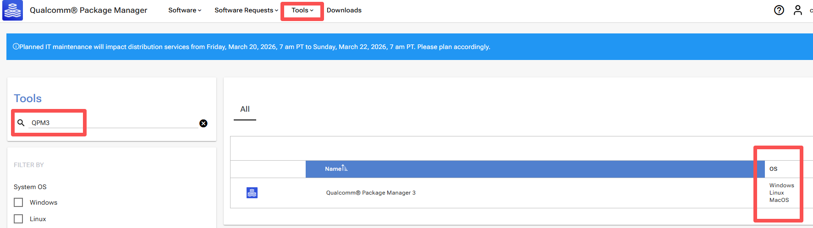
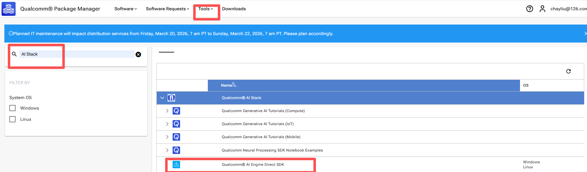
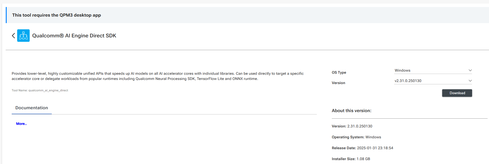

# 账户注册

- 进入 [页面](https://myaccount.qualcomm.com/login?TYPE=33554433&REALMOID=06-0006f786-a2f4-1c10-ad60-90840a310000&GUID=&SMAUTHREASON=0&METHOD=GET&SMAGENTNAME=-SM-3povwZYzFq7kK5igjUBYgAdpxIaTZVkPnsewLqmuJzlQ75llbe6K2%2fAof8H6S9Ca&TARGET=-SM-HTTPS%3a%2f%2fopenid%2equalcomm%2ecom%2faffwebservices%2fredirectjsp%2fredirect_openid%2ejsp%3fresponse_type%3dcode%26client_id%3d000bec67--6570--185d--ab94--90820a312020%26state%3dcDM5YWx6d2FBd2hTWGtxZ1ZyS2t--NWd--Rjk0eWNjVmg5MGJSTEo4ZS1zSktL%26redirect_uri%3dhttps-%3A-%2F-%2Fqpm%2equalcomm%2ecom%26scope%3dopenid-%20profile%26code_challenge%3d94QYGhYIHPgI7jk5VyG5fnriUDFoO9iDrIUGEiGUbZY%26code_challenge_method%3dS256%26nonce%3dcDM5YWx6d2FBd2hTWGtxZ1ZyS2t--NWd--Rjk0eWNjVmg5MGJSTEo4ZS1zSktL%26SMPORTALURL%3dhttps-%3A-%2F-%2Fopenid%2equalcomm%2ecom-%2Faffwebservices-%2FCASSO-%2Foidc-%2FQPM--Prd-%2Fauthorize) 完成账户注册。


- 进入 [页面](https://www.qualcomm.com/agreements) 完成协议签署。

# 下载和安装

- 进入 [页面](https://qpm.qualcomm.com/#/main/home) 选择 Tools，下载 QPM3。



这里采用 Linux 下举例:
```
sudo dpkg -i QualcommPackageManager3.3.0.131.3.Linux-x86.deb
```

也可以采用下面的方式，先登录账户：
```
qpm-cli --login  <username>
```

如果没有签署上面的协议，这里可能登录失败。

执行：
```
qpm-cli --install QPM3
```

进入 [页面](https://qpm.qualcomm.com/#/main/tools/find) 选择 AI Stack:



继续选择合适的版本：



提取文件：
```
qpm-cli --extract qualcomm_ai_engine_direct.2.23.0.240601.Linux-AnyCPU.qik
```

成功之后输出安装的具体位置:
```
SUCCESS: Installed qualcomm_ai_engine_direct.Core at /opt/qcom/aistack/qairt/2.23.0.240601
```


# 环境安装

参考安装目录下的 `docs` 进行。

从 [页面](https://dl.google.com/android/repository/android-ndk-r26c-linux.zip) 下载 Android NDK。

- 安装 conda 环境：
```
conda create -n qnn python==3.10
```

- 设置 SDK 根目录：
```
export QNN_SDK_ROOT="/opt/qcom/aistack/qairt/2.23.0.240601"
```

- 执行:
```
sudo bash ${QNN_SDK_ROOT}/bin/check-linux-dependency.sh
```

- 设置 NDK 环境变量：
```
export ANDROID_NDK_ROOT="/home/master/tools/android-ndk-r26c"
export PATH=${ANDROID_NDK_ROOT}:${PATH}
```

- 安装依赖库，例如使用下面的 `req.txt`
```
numpy==1.26.4
onnx==1.12.0
onnxruntime==1.17.1
onnxsim==0.4.36
```
```
pip install -r req.txt
```

- 激活环境
```
export QNN_SDK_ROOT="/opt/qcom/aistack/qairt/2.23.0.240601"
source ${QNN_SDK_ROOT}/bin/envsetup.sh
```


