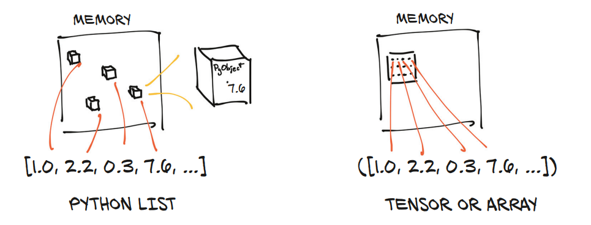

张量的底层实现基于一个关键设计：数据存储与视图分离。

# 元数据
| 核心概念 | 英文属性名 | 定义与功能 | 关键特性/示例 | 进阶说明 |
| :--- | :--- | :--- | :--- | :--- |
| **存储指针** | `storage_ptr` | 指向底层连续内存块 (`Storage`) 的起始**字节**地址。 | **共享性**：多个 Tensor 可指向同一块 `Storage` 的不同位置。<br>**零拷贝**：视图 (View) 操作仅复制此指针和元数据，不复制数据本身。 | 它是 `void*` 或 `uint8_t*` 类型。<br>计算物理地址时必须结合 `element_size`。 |
| **存储偏移** | `storage_offset` | 数据在 `Storage` 中的起始**元素**索引（从第几个元素开始读）。 | **切片基础**：执行 `x[1:]` 时，通常只增加 `offset`，`ptr` 不变。<br>**单位**：元素个数 (非字节)。 | 即使 `offset` 很大，只要 `offset + numel` 不超过 `storage_size` 即合法。 |
| **逻辑形状** | `size` (Shape) | Tensor 呈现给用户的逻辑维度结构 (如 `[3, 2]`)。 | **视图伪装**：`reshape`/`view` 仅改变元数据，无需移动内存。<br>**逻辑总量**：$\prod \text{size}[i]$。 | 逻辑元素总数通常 $\le$ `storage_size` (切片后常见“大存储小视图”)。 |
| **步长** | `stride` | **最关键概念**。在某维度索引 +1 时，需在 `Storage` 中跳过的**元素个数**。 | **寻址公式**：<br>$$ \text{ElemIndex} = \text{offset} + \sum_{k} (i_k \times \text{stride}[k]) $$<br>**物理地址**：<br>$$ \text{Addr} = \text{ptr} + \text{ElemIndex} \times \text{element\_size} $$ | **可为负数**：支持 `flip` (翻转) 操作而不拷贝内存。<br>**单位**：元素个数。 |
| **内存连续性** | `is_contiguous` | 判断逻辑顺序是否与底层物理存储顺序完全一致。 | **判定标准**：<br>1. 最后维 `stride` 必须为 1。<br>2. 前维 `stride` = 后维 `size` × 后维 `stride`。<br>**断裂场景**：`transpose`, `permute`, 窄切片。 | **非连续后果**：<br>1. `view()` 可能报错 (需 `contiguous()`)。<br>2. 某些底层循环无法使用 SIMD 优化。<br>3. 序列化或拷贝到 C 数组时需额外处理。 |
| **元素大小** | `element_size` | 单个元素占用的字节数 (如 `float32`=4, `int64`=8)。 | **桥梁作用**：连接“逻辑索引”与“物理字节地址”的关键因子。 | 忽略它会导致地址计算错位 (例如把索引当字节用)。 |
| **存储容量** | `storage_size` | 底层 `Storage` 实际分配的总容量 (元素个数或字节数)。 | **隐藏风险**：`storage_size` 往往远大于 `tensor.numel()` (切片后保留原内存)。 | 访问 `numel()` 之外但在 `storage_size` 内的内存属于**逻辑越界** (数据可能是脏的)。 |

```
import torch

def print_tensor_info(tensor, label):
    """辅助函数：打印 Tensor 的关键内存属性"""
    print(f"\n--- {label} ---")
    print(f"Tensor: {tensor}")
    print(f"Shape (size): {tensor.size()}")
    print(f"Stride: {tensor.stride()}")
    print(f"Storage Offset: {tensor.storage_offset()}")
    print(f"Element Size (bytes): {tensor.element_size()}")
    print(f"Is Contiguous: {tensor.is_contiguous()}")

    # 计算存储指针 (十六进制)
    storage = tensor.storage()
    ptr = storage.data_ptr()
    print(f"Storage Data Ptr (Base): 0x{ptr:x}")

    # 计算当前 Tensor 指向的物理起始地址
    # 公式: Addr = Base_Ptr + (Offset * Element_Size)
    current_addr = ptr + (tensor.storage_offset() * tensor.element_size())
    print(f"Current Tensor Start Addr: 0x{current_addr:x}")

    # 显示底层存储总大小 (元素个数)
    print(f"Storage Total Size (elements): {len(storage)}")
    print("-" * 30)

# 连续内存
x = torch.tensor([[1, 2, 3],
                  [4, 5, 6]], dtype=torch.float32)
print_tensor_info(x, "原始 Tensor (x)")

# --- 原始 Tensor (x) ---
# Tensor: tensor([[1., 2., 3.],
#         [4., 5., 6.]])
# Shape (size): torch.Size([2, 3])
# Stride: (3, 1)
# Storage Offset: 0
# Element Size (bytes): 4
# Is Contiguous: True
# Storage Data Ptr (Base): 0x55f244b2ca80
# Current Tensor Start Addr: 0x55f244b2ca80
# Storage Total Size (elements): 6

# 切片操作：改变 Offset (零拷贝)
y = x[1:]
print_tensor_info(y, "切片后 (y = x[1:])")

# --- 切片后 (y = x[1:]) ---
# Tensor: tensor([[4., 5., 6.]])
# Shape (size): torch.Size([1, 3])
# Stride: (3, 1)
# Storage Offset: 3
# Element Size (bytes): 4
# Is Contiguous: True
# Storage Data Ptr (Base): 0x55f244b2ca80
# Current Tensor Start Addr: 0x55f244b2ca8c
# Storage Total Size (elements): 6

# 转置操作：改变 Stride (导致非连续)
z = x.t()
print_tensor_info(z, "转置后 (z = x.t())")

# Tensor: tensor([[1., 4.],
#         [2., 5.],
#         [3., 6.]])
# Shape (size): torch.Size([3, 2])
# Stride: (1, 3)
# Storage Offset: 0
# Element Size (bytes): 4
# Is Contiguous: False
# Storage Data Ptr (Base): 0x55f244b2ca80
# Current Tensor Start Addr: 0x55f244b2ca80
# Storage Total Size (elements): 6


try:
    # 对非连续张量 z 直接调用 view，通常会报错或行为受限
    # 这里尝试将其 view 成 [6]，由于 z 是非连续的，view 会失败
    w = z.view(-1)
    print("意外成功：某些版本可能允许，但通常非连续不能直接 view 展平")
except RuntimeError as e:
    print(f"预期错误: {e}")
    print("解决方法：先调用 .contiguous() 整理内存")

# contiguous()：强制内存拷贝
z_contig = z.contiguous()
w = z_contig.view(-1)
print_tensor_info(w, "整理内存后展平 (w = z.contiguous().view(-1))")

# --- 整理内存后展平 (w = z.contiguous().view(-1)) ---
# Tensor: tensor([1., 4., 2., 5., 3., 6.])
# Shape (size): torch.Size([6])
# Stride: (1,)
# Storage Offset: 0
# Element Size (bytes): 4
# Is Contiguous: True
# Storage Data Ptr (Base): 0x55f245365440
# Current Tensor Start Addr: 0x55f245365440
# Storage Total Size (elements): 6
```

`t.contiguous()` 返回一个包含与张量 `t` 相同数据的连续张量。如果张量 `t` 已经是连续的，这个函数返回 `t` 本身。


# 存储 (Storage)
张量的数据本身并不直接存在于 `torch.Tensor` 对象中，而是存在于底层的 `torch.Storage` 对象里。`Storage` 是一块连续的、一维的内存区域。存储的是未装箱的 (Unboxed) C 原生类型（如 float32, int64），没有 Python 对象的开销（无引用计数、无类型指针）。

优点：
- 内存紧凑：100 万个 float32 仅占 4MB(`1,000,000 × 4字节 = 4,000,000 `)
- 缓存友好：CPU 预取机制可以一次性加载相邻数据，极大提升遍历速度
- GPU 就绪：连续的内存块可以直接通过 PCIe 总线批量传输到 GPU 显存，进行并行计算

```
import torch

# 创建一个2D张量
points = torch.tensor([[4.0, 1.0],
                       [5.0, 3.0],
                       [2.0, 1.0]])
print(points)

# 访问底层的存储
storage = points.storage()
print(storage)
# 输出:
# 4.0
# 1.0
# 5.0
# 3.0
# 2.0
# 1.0
# [torch.storage.TypedStorage(dtype=torch.float32, device='cpu') of size 6]
```

## 张量和存储之间的关系



- 张量是存储的视图(View)：张量通过偏移量和步长来索引存储
- 多个张量可共享同一 storage：不同的张量可以以不同方式索引同一块内存
- 内存只分配一次：创建张量视图时不会重新分配内存

## 存储的索引机制
- 不能使用二维索引直接访问存储
- 张量负责将多维索引转换为存储中的一维位置

```
points = torch.tensor([[4.0, 1.0],
                       [5.0, 3.0],
                       [2.0, 1.0]])

storage = points.storage()

print(storage[0]) # 4.0
print(storage[-1]) # 1.0
print(storage[0 , 1]) # RuntimeError: can't index a <class 'torch.storage.TypedStorage'> with <class 'tuple'>
```
修改存储会影响所有引用它的张量：
```
storage[0] = 2.0
print(points)  # tensor([[2., 1.], [5., 3.], [2., 1.]])
```

## 原地操作
| 特性维度 | 不带下划线 (`Tensor.op()`) <br> *非原地操作* | 带下划线 (`Tensor.op_()`) <br> *原地操作* |
| :--- | :--- | :--- |
| **内存分配** | **分配新内存**<br>创建新的 `Storage` 块存放结果。 | **不分配新内存**<br>直接复用原有的 `Storage` 块。 |
| **对象返回** | **返回新 Tensor 对象**<br>新对象指向新的内存地址。 | **返回原 Tensor 对象**<br>对象 ID (`id()`) 不变，仍指向原地址。 |
| **原数据状态** | **保持不变**<br>原 Tensor 的数据未被修改，可继续用于其他计算。 | **被直接覆盖**<br>原数据丢失，不可恢复（破坏了“不可变性”）。 |
| **底层机制** | 计算结果 $\rightarrow$ 新 `Storage` $\rightarrow$ 新 `Tensor` | 定位原 `Storage` (通过 `offset`/`stride`) $\rightarrow$ **直接覆写二进制数据** |
| **内存开销** | **较高**<br>峰值内存占用增加，需额外分配。 | **极低**<br>无额外分配，适合显存受限场景。 |
| **性能影响** | **有分配/释放开销**<br>频繁操作会增加 GC (垃圾回收) 压力。 | **无分配开销**<br>速度更快，减少内存碎片。 |
| **主要风险** | 内存溢出 (OOM) 风险较低，但可能因累积未释放导致 OOM。 | **计算图断裂风险**<br>若在反向传播中修改了需要求导的中间变量，会导致报错或梯度错误。 |
| **典型场景** | 默认推荐，保证代码安全性和逻辑清晰。 | 显存极度紧张、自定义底层算子、或确定不再需要旧值时。 |

```
import torch

# 创建一个包含 [1.0, 2.0, 3.0] 的一维浮点张量
# 此时 PyTorch 会在内存中分配存储空间，并让张量 a 指向它
a = torch.tensor([1.0, 2.0, 3.0])

# 获取张量底层存储（Storage）在内存中的物理地址指针
# 这代表了实际存放数值 [1.0, 2.0, 3.0] 的内存位置
original_ptr = a.storage().data_ptr()

# 获取张量对象 a 本身的 Python ID
# 这代表了 'a' 这个变量所引用的 Python 对象的身份标识
original_id = id(a)

# 执行原地清零操作
a.zero_()


new_ptr = a.storage().data_ptr()
new_id = id(a)

print(original_ptr == new_ptr) # True
print(original_id == new_id) # True
print(a)  # tensor([0., 0., 0.])
```


# 视图 (View)

PyTorch 允许张量作为现有张量的视图存在。视图张量与其基础张量共享相同的底层数据。支持视图避免了显式数据复制，从而使我们能够进行快速且内存高效的重塑、切片和逐元素操作。

```
import torch

# 创建原始张量
# 在内存中分配一块连续空间，存储 16 个随机浮点数 (4x4=16)
# 此时 t 是这块内存的“默认视图”
t = torch.rand(4, 4)

# view() 操作仅修改元数据 (shape 从 [4,4] 变为 [2,8], stride 相应调整)
# 它【不】分配新内存，b 和 t 指向完全相同的底层 Storage 地址
b = t.view(2, 8)
# 验证内存共享
print(t.storage().data_ptr() == b.storage().data_ptr())  # True

# 修改视图数据
# 由于内存共享，这个操作直接改写了底层 Storage 中的第一个数值
b[0][0] = 3.14
print(t[0][0]) # tensor(3.1400)
```


