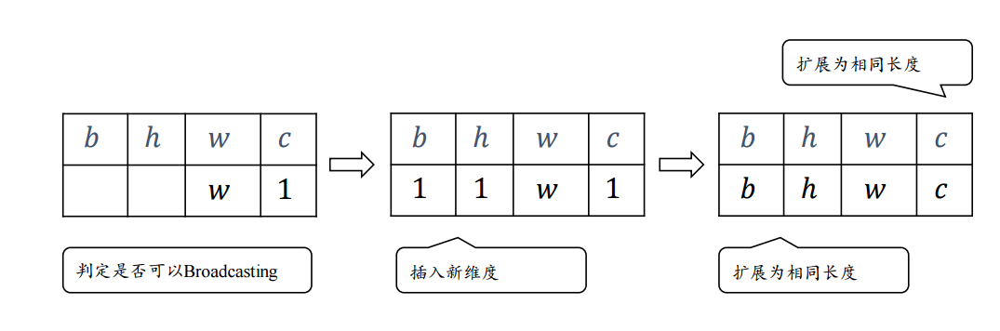

# 逐点操作
逐点操作对张量中的每一个元素独立进行数学运算，输入与输出形状完全一致。

| 类别 | 函数/运算符 | 数学公式 | 功能描述 | 典型应用场景 |
| :--- | :--- | :--- | :--- | :--- |
| **基础算术** | `torch.add` / `+` | $y = x + c$ | 加法 (支持标量广播) | 偏置项添加 (Bias)、残差连接 |
| | `torch.sub` / `-` | $y = x - c$ | 减法 | 计算误差、中心化数据 |
| | `torch.mul` / `*` | $y = x \cdot c$ | 乘法 (逐元素积，**非**矩阵乘) | 缩放、掩码应用 (Masking) |
| | `torch.div` / `/` | $y = x / c$ | 除法 | 归一化、计算比率 |
| | `torch.pow` / `**` | $y = x^n$ | 幂运算 | 距离平方计算、多项式特征 |
| **激活函数** | `torch.relu` | $y = \max(0, x)$ | 线性整流单元 | 神经网络隐藏层激活 |
| | `torch.sigmoid` | $y = \frac{1}{1+e^{-x}}$ | Sigmoid 函数 | 二分类输出、门控机制 (LSTM/GRU) |
| | `torch.tanh` | $y = \frac{e^x - e^{-x}}{e^x + e^{-x}}$ | 双曲正切 | 循环神经网络激活、数据压缩到 (-1, 1) |
| | `torch.softmax` | $y_i = \frac{e^{x_i}}{\sum e^{x_j}}$ | 归一化指数 (*沿指定维度) | 多分类概率输出 |
| **指数对数** | `torch.exp` | $y = e^x$ | 自然指数 | 概率计算、数值稳定性处理 (Log-Sum-Exp) |
| | `torch.log` | $y = \ln(x)$ | 自然对数 | 损失函数 (CrossEntropy)、似然估计 |
| | `torch.log10` | $y = \log_{10}(x)$ | 以10为底的对数 | 分贝计算、数据可视化缩放 |
| **三角函数** | `torch.sin` / `cos` | $y = \sin(x)$ | 正弦/余弦 | 位置编码 (Transformer)、信号处理 |
| | `torch.atan2` | $y = \arctan(y/x)$ | 四象限反正切 | 计算角度、极坐标转换 |
| **舍入取整** | `torch.floor` | $y = \lfloor x \rfloor$ | 向下取整 | 离散化、索引计算 |
| | `torch.ceil` | $y = \lceil x \rceil$ | 向上取整 | 填充计算 (Padding size) |
| | `torch.round` | $y \approx x$ | 四舍五入 | 量化感知训练 |
| **统计比较** | `torch.abs` | $y = \|x\|$ | 绝对值 | L1 损失、距离计算 |
| | `torch.clamp` | $y = \min(\max(x, min), max)$ | 截断/钳位 | 防止梯度爆炸、限制数值范围 |
| | `torch.sqrt` | $y = \sqrt{x}$ | 平方根 | 标准差计算、欧氏距离 |
| | `torch.rsqrt` | $y = \frac{1}{\sqrt{x}}$ | 倒数平方根 | LayerNorm 中的标准化系数 |


# 广播机制
广播机制的作用是允许形状不同的张量进行算术运算，无需显式复制数据。

从后向前对比维度，若满足以下条件之一即可广播：
- 维度大小相等
- 其中一个维度大小为 1
- 其中一个张量在该维度缺失（视为 1）


结果形状：取各维度最大值。




```
import torch

a = torch.randn(2,3,32,32)
b = torch.randn(32,1)

add_result = a + b
print(add_result.shape)

sub_result = a - b
print(sub_result.shape)

mul_result = a * b
print(mul_result.shape)

div_result = a * b
print(div_result.shape)
```

# 归约操作
归约操作将多维 Tensor 沿着指定维度进行压缩，减少维度数量，输出统计值。

| 函数 | 功能描述 | 代码示例 | 备注 |
| :--- | :--- | :--- | :--- |
| `torch.sum` | 求和 | `torch.sum(x, dim=0)` | 常用于计算 Loss 总和或 Mask 计数 |
| `torch.mean` | 求平均值 | `torch.mean(x, dim=1)` | 全局平均池化 (GAP) 的核心 |
| `torch.max` / `min` | 求最大/最小值 | `val, idx = torch.max(x, dim=1)` | 返回 (值, 索引) 元组 |
| `torch.argmax` | 最大值索引 | `torch.argmax(x, dim=1)` | 分类任务中获取预测类别 |
| `torch.argmin` | 最小值索引 | `torch.argmin(x, dim=1)` | - |
| `torch.prod` | 求积 | `torch.prod(x, dim=0)` | 计算形状元素总数常用 `x.numel()` 代替 |
| `torch.std` | 标准差 | `torch.std(x, dim=0, unbiased=True)` | 批归一化 (BatchNorm) 内部使用 |
| `torch.var` | 方差 | `torch.var(x, dim=0)` | - |
| `torch.any` | 是否存在真值 | `torch.any(x > 0)` | 类似逻辑 OR 归约，返回标量或向量 |
| `torch.all` | 是否全为真值 | `torch.all(x > 0)` | 类似逻辑 AND 归约 |

```
import torch

x = torch.tensor([
    [1, 2, 3],
    [4, 5, 6]
])

# 全局求和 (不指定 dim)
sum_all = torch.sum(x)
print(sum_all) # tensor(21)
print(sum_all.shape) # torch.Size([]),  标量 (0维张量)

# dim=0 代表“行”的方向。沿着行向下压缩，即计算每一列的和。
# 第0列: 1+4=5, 第1列: 2+5=7, 第2列: 3+6=9
sum_col = torch.sum(x, dim=0)
print(sum_col) # tensor([5, 7, 9])
# 结果形状: 原形状 [2, 3] 去掉第0维 -> [3]
print(sum_col.shape) # torch.Size([3])

# dim=1 代表“列”的方向。沿着列向右压缩，即计算每一行的和。
# 第0行: 1+2+3=6, 第1行: 4+5+6=15
sum_row = torch.sum(x, dim=1)
print(sum_row) # tensor([ 6, 15])
# 结果形状: 原形状 [2, 3] 去掉第1维 -> [2]
print(sum_row.shape) # torch.Size([2])

great_then_4 = torch.any(x > 4)
print(great_then_4) # tensor(True)

even_number = torch.any(x % 2 ==0)
print(even_number) # tensor(True)
```


# 比较操作

## 逐元素比较
返回与输入同形状的布尔 Tensor。

| 函数 | 运算符 | 功能 | 示例 |
| :--- | :--- | :--- | :--- |
| `torch.gt` / `>` | Greater Than | 大于 | `x > 0` |
| `torch.ge` / `>=` | Greater Equal | 大于等于 | `x >= 0` |
| `torch.lt` / `<` | Less Than | 小于 | `x < 0` |
| `torch.le` / `<=` | Less Equal | 小于等于 | `x <= 0` |
| `torch.eq` / `==` | Equal | 等于 | `x == y` |
| `torch.ne` / `!=` | Not Equal | 不等于 | `x != y` |

## 整体/状态比较
| 函数 | 功能 | 示例 | 应用场景 |
| :--- | :--- | :--- | :--- |
| `torch.equal` | 严格相等 | `torch.equal(x, y)` | 两个 Tensor 形状且所有元素完全一致返回 True |
| `torch.allclose` | 近似相等 | `torch.allclose(x, y, atol=1e-8)` | 浮点数比较必备，允许微小误差 (rtol, atol) |
| `torch.isnan` | 检查 NaN | `torch.isnan(x)` | 调试梯度爆炸/无效输入 |
| `torch.isinf` | 检查 Inf | `torch.isinf(x)` | 调试除以零错误 |
| `torch.isfinite` | 检查有限值 | `torch.isfinite(x)` | 确保数据干净 (非 NaN 且非 Inf) |
| `torch.any` | 存在性检查 | `torch.any(x != 0)` | 替代不存在的 is_nonzero |
| `torch.all` | 全称量词检查 | `torch.all(x > 0)` | 检查是否全部满足条件 |

其中：
`torch.allclose` 是 PyTorch 中用于比较两个张量（Tensor）是否“近似相等”的核心函数:
```
torch.allclose(input: Tensor, other: Tensor, rtol: float = 1e-05, atol: float = 1e-08, equal_nan: bool = False) → bool
```
由于浮点数精度误差（Floating Point Precision Errors），直接使用 `==` 或 `torch.equal` 往往会导致误判（即两个数学上相等的值，在计算机底层存储时可能有极微小的差异）。`torch.allclose ` 通过引入容差机制来解决这个问题：两个数的差值（绝对误差），必须小于‘一个固定的最小容错值’加上‘一个按比例计算的容错值：
$$
| \text{input}_i - \text{other}_i | \leq \text{atol} + \text{rtol} \times | \text{other}_i |
$$

- `atol (Absolute Tolerance)`：当数值非常小（接近 0）时，$rtol * |other|$ 趋近于 0，此时主要靠 `atol` 来判断，防止在 0 附近因为极小的噪声导致判断失败
- `rtol (Relative Tolerance)`:  当数值很大时，$rtol * |other|$ 变大，允许的误差范围也随之变大，适应浮点数在大数值下的精度损失特性

```
import torch


a = torch.tensor([1.00000])
b = torch.tensor([1.000001])

# 实际误差: |a - b| = |1.0 - 1.000001| = 0.000001 = 1e-6
# 允许误差:
#   atol = 1e-8 = 0.00000001
#   rtol * |b| ≈ 1e-5 * 1.000001 ≈ 1.000001e-5
# 总允许误差： ≈ 1e-8 + 1e-5 ≈ 1.00001e-5

compare = torch.allclose(a, b)
print(compare) # True
```

# 线性代数

## 矩阵乘法

| 函数 | 描述 | 示例 | 备注 |
| :--- | :--- | :--- | :--- |
| `torch.matmul` / `@` | 矩阵乘法 | `C = A @ B` | 支持广播，处理 1D/2D/ND 最智能 |
| `torch.mm` | 2D 矩阵乘法 | `C = torch.mm(A, B)` | 仅限 2D，速度略快，不支持广播 |
| `torch.mv` | 矩阵向量乘 | `y = torch.mv(A, v)` | 2D Matrix * 1D Vector |
| `torch.bmm` | 批矩阵乘法 | `C = torch.bmm(A, B)` | `(B, N, M) @ (B, M, P)`，Transformer 中 Q*K^T 常用 |

```
import torch


# A 形状: [10, 3, 4] (10个批次，每个是 3x4 矩阵)
# B 形状: [4, 5]     (普通的 4x5 矩阵)
A = torch.randn(10, 3, 4)
B = torch.randn(4, 5)

# 机制：@ 运算符会自动将 B 广播到 10 个批次，执行 10 次 (3x4) @ (4x5)
C = A @ B
# 批次保持不变，矩阵乘法结果 3x5)
print(C.shape) # torch.Size([10, 3, 5])


A = torch.randn(2, 3)
B = torch.randn(3, 4)

# 场景：仅用于两个严格的 2D 张量相乘
# 注意：不支持广播，如果输入维度不是 2D 会报错
C = torch.mm(A, B)
print(C.shape)


A = torch.tensor([[1, 2, 3],
                  [4, 5, 6]])

v = torch.tensor([1, 1, 1])

# 专门用于 2D 矩阵 * 1D 向量
# A 形状: [2, 3] (2行3列的矩阵)
# v 形状: [3]    (长度为3的向量)
y = torch.mv(A, v)
print(y) # tensor([ 6, 15])


A = torch.randn(2, 3, 4)  # batch=2
B = torch.randn(2, 4, 5)
# 两个 3D 张量进行逐批次的矩阵乘法
# 要求：两个张量的第一维（Batch size）必须完全一致，且都是 3D
# 不支持广播，如果 batch 维度不同会直接报错
C = torch.bmm(A, B)
print(C.shape) # torch.Size([2, 3, 5])
```
## 分解与逆
| 函数 | 功能 | 示例 |
| :--- | :--- | :--- |
| `torch.inverse` | 矩阵求逆 | `torch.inverse(A)` |
| `torch.det` | 行列式 | `torch.det(A)` |
| `torch.svd` / `torch.linalg.svd` | 奇异值分解 | `U, S, Vh = torch.linalg.svd(A)` |
| `torch.eig` / `torch.linalg.eig` | 特征值分解 | `eigenvalues, eigenvectors = torch.linalg.eig(A)` |
| `torch.qr` | QR 分解 | `Q, R = torch.qr(A)` |
| `torch.cholesky` | Cholesky 分解 | `L = torch.cholesky(A)` (用于正定矩阵) |

## 范数与距离
| 函数 | 功能 | 示例 |
| :--- | :--- | :--- |
| `torch.norm` | 计算范数 | `torch.norm(x, p=2)` (L2 范数) |
| `torch.dist` | 两点距离 | `torch.dist(x1, x2, p=2)` |
| `torch.cdist` | 批量距离 | `torch.cdist(x1, x2, p=2)` (计算两组点之间的成对距离) |